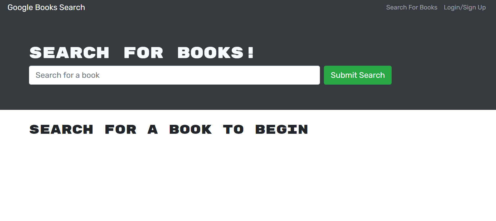
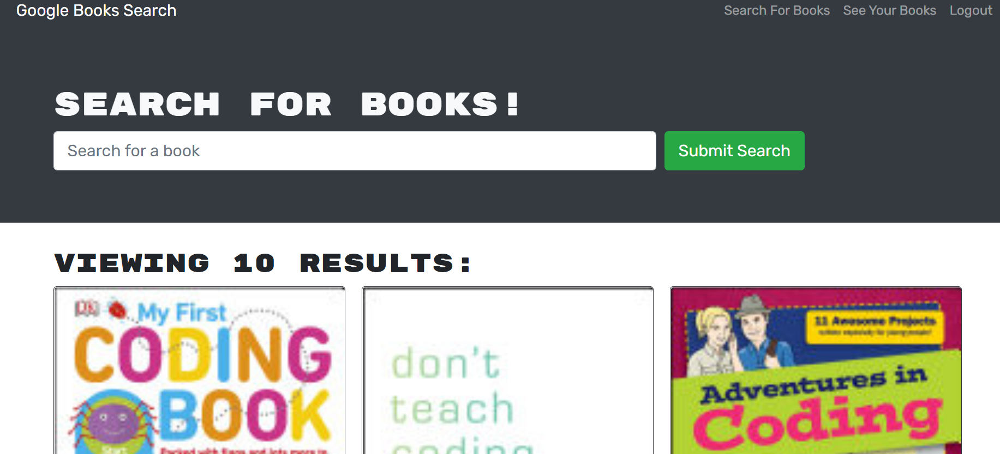
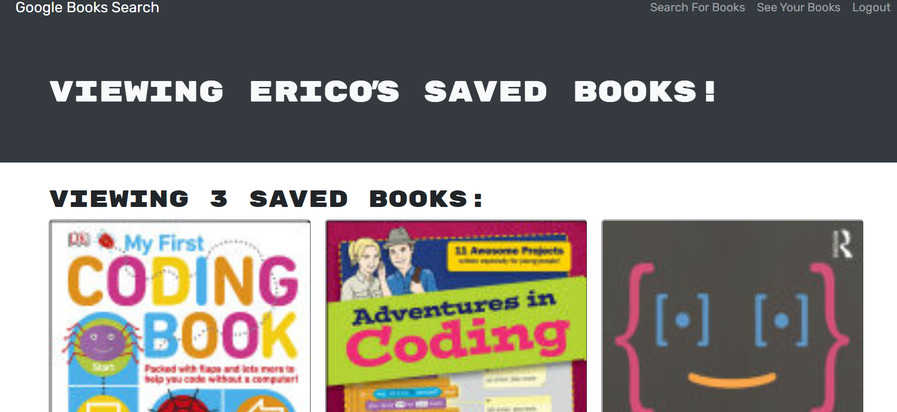

# book-search-engine2

The task consist on refactoring a fully functioning Google Books API search engine, built with RESTful API, into a GraphQL API built with Apollo Server.

## Description

Modern websites are driven by two things: data and user demands. This shouldn't come as a surprise, as the ability to personalize user data is the cornerstone of real-world web development today. And as user demands evolve, applications need to be more performant. The book search engine allow you to search for books, and save them in your account.

## Technologies Used

* `Node.js`
* `npm (Node Package Manager)`
* `Javascript`
* `React`
* `React Router`
* `Apollo-server`
* `Bcrypt`
* `Mongoose`
* `MongooseDB Atlas`


## User Story

```md
AS AN avid reader
I WANT to search for new books to read
SO THAT I can keep a list of books to purchase
```

## Application Screenshots





## Application Links
* [Github](https://github.com/AlCharl88/book-search-engine2)
* [Live Deployment](https://cryptic-beach-50325.herokuapp.com)

## Contact 

Alain Tagne - [Github](https://github.com/AlCharl88) Email: [Alain](mailto:alctagne@gmail.com) 

---

&copy; 2021 Alain Tagne